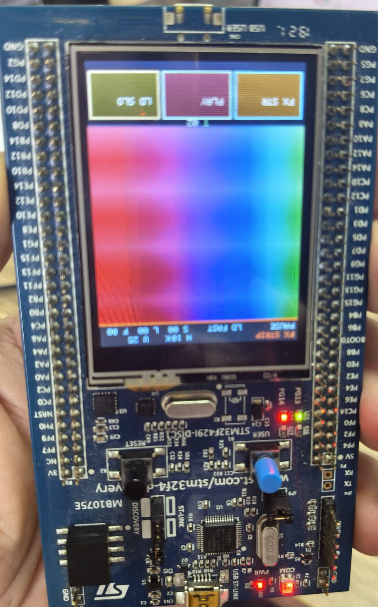

# FreeRTOS STM32F429 Touch LCD Project

Bu proje, STM32F429I-DISC1 geliştirme kartı üzerinde FreeRTOS kullanılarak hazırlanmış gömülü sistem uygulamasıdır. Projede LCD ekran, dokunmatik panel, LED kontrolü, buton kesmesi, zamanlayıcılar, kuyruklar, semaphore, mutex ve event flag yapıları birlikte kullanılmıştır.

## Proje Görüntüsü



## Kullanılan Donanım

- STM32F429I-DISC1
- STM32F429ZITx mikrodenetleyici
- 240x320 TFT LCD
- Dokunmatik panel
- LD3 / LD4 LED
- Kullanıcı butonu
- USB Host CDC

## Kullanılan Teknolojiler

- STM32CubeMX
- STM32 HAL
- FreeRTOS / CMSIS-RTOS v2
- CMake
- C dili
- LTDC
- FMC / SDRAM
- I2C3
- SPI5
- USART1
- USB Host CDC

## Özellikler

- FreeRTOS üzerinde birden fazla task kullanımı
- LED kontrol task’i
- Buton okuma ve kısa/uzun basma algılama
- Dokunmatik ekran üzerinden kontrol
- LCD üzerinde animasyonlu grafik arayüz
- Wave ve stripe olmak üzere iki farklı efekt modu
- Animasyonu başlatma/durdurma
- LED hızını değiştirme
- Heap ve uptime bilgisini ekranda gösterme
- FPS takibi
- Double buffering ile LCD görüntü güncelleme
- USB Host CDC altyapısı

## FreeRTOS Yapıları

Projede aşağıdaki RTOS bileşenleri kullanılmıştır:

- Thread / Task
- Message Queue
- Semaphore
- Mutex
- Event Flags
- Software Timer

## Task Yapısı

- `defaultTask`: USB Host başlatma işlemleri
- `ledTask`: LD3 LED’inin belirli aralıklarla yakılıp söndürülmesi
- `buttonTask`: Kullanıcı butonunun okunması ve kısa/uzun basma ayrımı
- `touchTask`: Dokunmatik panelden koordinat okuma
- `displayTask`: LCD animasyonları ve arayüz çizimi
- `statsTask`: Heap ve çalışma süresi bilgilerinin güncellenmesi

## Derleme

Proje CMake tabanlıdır. STM32CubeMX veya VS Code STM32 eklentileri ile açılıp derlenebilir.

```bash
cmake --preset Debug
cmake --build build/Debug